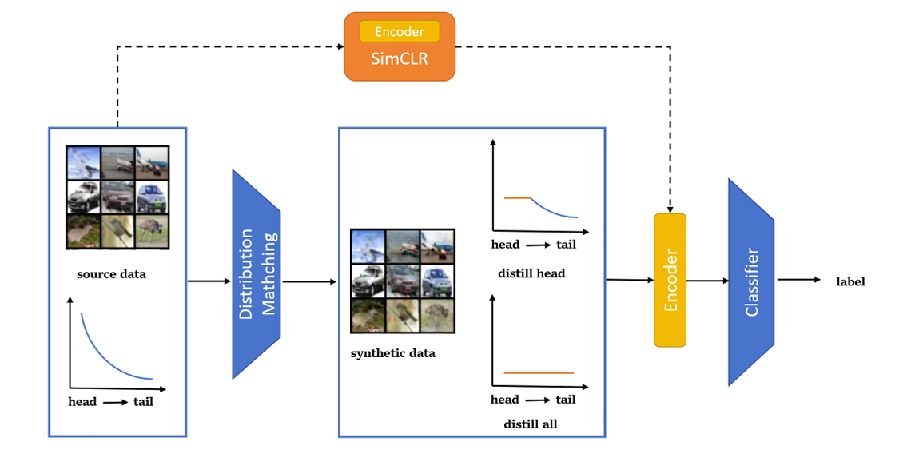

# CRLT-DD: Condense and Rebalance Long-Tailed Dataset with Dataset Distillation

> SJTU Course CS348: Computer Vision (2023 Fall) Team A Project



## Set Up

Install pre-requirements by `pip install -r requirements.txt`.

## Usage

#### Baseline

```python
python baseline.py --dataset [CIFAR10-LT/CIFAR100-LT]  --imb_factor [0.1/0.2/0.01]
```

#### Experiments

```python
python main_DM.py  --dataset [CIFAR10-head/CIFAR100-head] --imb_factor [0.1/0.2/0.01] --model ConvNet  --ipc [50/100/500]  --init [noise/real] --num_exp 5  --num_eval 3 --partial_condense [T/F] --add_aug [T/F] --aug_size 100 
```

## References

Our code refers the following repositories:

- [DatasetCondensation](https://github.com/VICO-UoE/DatasetCondensation)

- [MiSLAS](https://github.com/dvlab-research/MiSLAS/blob/main/datasets/cifar10.py)

- [SimCLR](https://github.com/sthalles/SimCLR)
